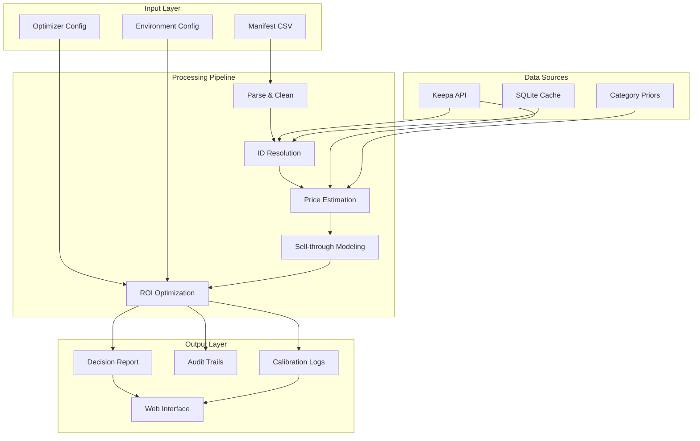
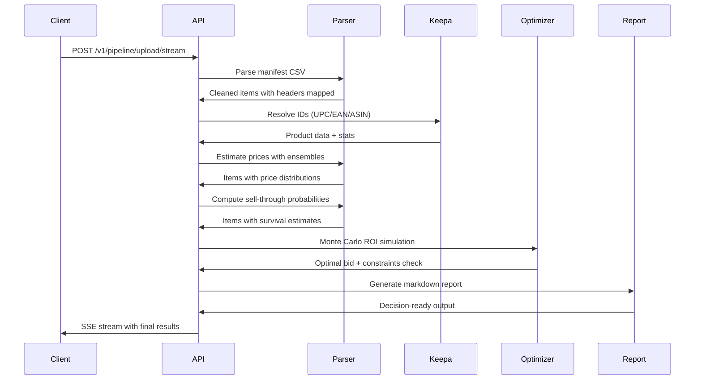
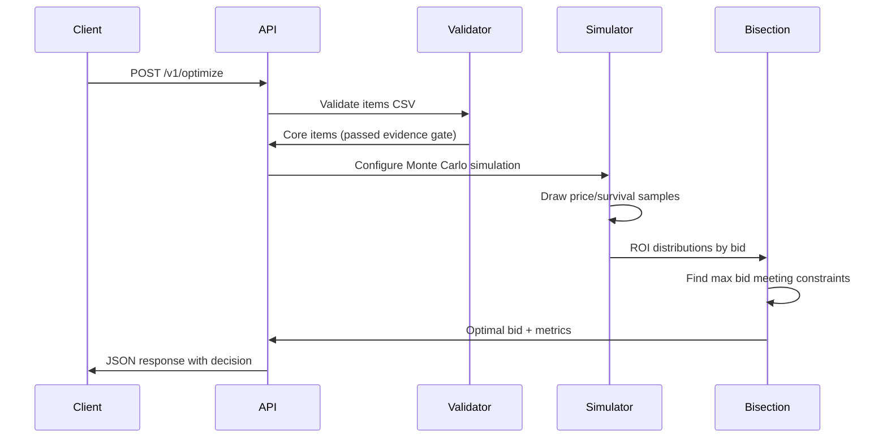

# Architecture Overview

Lot Genius transforms messy B-Stock manifest CSVs into decision-ready investment analysis through a multi-stage pipeline combining data enrichment, pricing models, survival analysis, and Monte Carlo optimization.

## System Architecture

## Data Flow

### 1. Pipeline Processing

### 2. Optimization Call

## Core Modules

### lotgenius.datasources

**Scraper Query Strategy:**

Query execution follows priority order:

1. **Exact UPC lookup** - Direct UPC search for fastest resolution
2. **Exact ASIN lookup** - Direct ASIN search when UPC unavailable
3. **"Brand" "Model" search** - Targeted brand/model combination
4. **Filtered title fallback** - Full title search with quality filters

**Quality Filtering Criteria:**

- **Similarity matching**: RapidFuzz similarity scores (configurable threshold)
- **Recency filters**: Lookback window for sold comparables
- **Model presence**: Verification of model information in results
- **Condition filters**: Exclusion of parts/broken/repair items (configurable)
- **Price outlier detection**: MAD K-factor filtering (default K=3.5)

**Configuration Variables:**

- `SCRAPER_SIMILARITY_MIN`: Minimum similarity threshold
- `PRICE_OUTLIER_K`: MAD K-factor for outlier detection (default 3.5)

### lotgenius.parsing

**Purpose**: Handle varied manifest formats with intelligent header mapping

- `HeaderMapper`: Fuzzy matching for column names
- `ManifestValidator`: Coverage and quality checks
- `ItemCleaner`: Normalize quantities, conditions, prices

### lotgenius.enrichment

**Purpose**: Resolve product identities and gather market data

- `KeepaDM`: API client with caching and rate limiting
- `IdResolver`: UPC/EAN/ASIN resolution with fallbacks
- `StatsEnricher`: Price, rank, and offer data collection

### lotgenius.pricing

**Purpose**: Multi-source price estimation with conservative floors

- `EnsemblePricer`: Inverse-variance weighted distributions
- `CategoryFloors`: Conservative price floors by category
- `PriceEvidence`: Compact audit trail export

### lotgenius.survivorship

**Purpose**: Sell-through probability modeling

- `SurvivalModels`: Default and ladder variants
- `MarketFactors`: Rank-to-sales mapping, offer saturation
- `PriceSensitivity`: Premium/discount impact on demand

### lotgenius.roi

**Purpose**: Monte Carlo ROI optimization with constraints

- `RoiSimulator`: Revenue simulation under fees/costs
- `BisectionOptimizer`: Constraint-aware bid finding
- `RiskMetrics`: P5/P50/P95 distributions and VaR

### lotgenius.calibration

**Purpose**: Prediction logging and outcomes analysis

- `PredictionLogger`: JSONL append-mode logging
- `CalibrationAnalysis`: Brier scores, binning, price metrics
- `OutcomesMatcher`: Join predictions with realized results

## Configuration & Constraints

### Key Environment Variables

| Variable                     | Default  | Purpose                     |
| ---------------------------- | -------- | --------------------------- |
| `SELLTHROUGH_HORIZON_DAYS`   | 60       | Sell-through time window    |
| `MIN_ROI_TARGET`             | 1.25     | Minimum ROI threshold       |
| `RISK_THRESHOLD`             | 0.80     | Confidence level (80%)      |
| `SURVIVAL_MODEL`             | "ladder" | Survival model variant      |
| `EVIDENCE_MIN_COMPS`         | 3        | Required sold comparables   |
| `EVIDENCE_REQUIRE_SECONDARY` | true     | Rank/offer signals required |

### Evidence Gating

Items must satisfy **confidence-aware evidence requirements** to enter core ROI analysis:

### Adaptive Evidence Thresholds

Evidence requirements scale with data quality:

**Base Requirements:**

- Valid UPC/EAN/ASIN with Keepa resolution
- 3 sold comparables within 180-day lookback window
- Secondary signals (sales rank trends OR offer presence)

**Ambiguity Adjustments:**
Additional comparables required based on ambiguity flags:

- `generic:title`: +1 comp for generic terms (bundle, lot, damaged, broken, repair, etc.)
- `ambiguous:brand`: +1 comp for missing/empty brand information
- `ambiguous:condition`: +1 comp for unknown/unspecified condition

**Adaptive Formula:** `required_comps = min(5, 3 + ambiguity_bonus_per_flag * flag_count)`

**Configuration Variables:**

- `EVIDENCE_MIN_COMPS_BASE`: Base requirement (default 3)
- `EVIDENCE_AMBIGUITY_BONUS_PER_FLAG`: Extra per flag (default 1)
- `EVIDENCE_MIN_COMPS_MAX`: Maximum cap (default 5)

**High-Trust ID Bypass:** Items with confident ASIN/UPC/EAN matches bypass all evidence gates.

Items failing evidence gate are marked **REVIEW** and excluded from optimization but appear in upside analysis.

### ROI Constraints

The optimizer finds maximum bid satisfying:

- **ROI Constraint**: P(ROI >= roi_target) >= risk_threshold
- **Cash Constraint**: E[cash_60d] >= min_cash_60d (optional)
- **VaR Constraint**: P5[cash_60d] >= min_cash_60d_p5 (optional)

Where ROI = (sold_net + salvage) / (bid + lot_fixed_cost)

## Survival Model Variants

### Default Model

Conservative baseline using:

- Keepa rank -> daily sales (power law)
- Offer saturation factor
- Price-to-market z-score sensitivity

### Ladder Model

Enhanced with category-specific scaling:

- Base hazard from default model
- Category alpha scaling factors
- Condition-aware adjustments
- Evidence-weighted coefficients

## Technology Stack

### Backend

- **Runtime**: Python 3.13
- **Framework**: FastAPI with async support
- **ML/Stats**: scikit-learn, scipy, numpy
- **Data**: pandas, SQLite (caching)
- **HTTP**: httpx for external APIs

### Frontend

- **Framework**: Next.js 14 with App Router
- **Language**: TypeScript (strict mode)
- **Styling**: Tailwind CSS utility-first
- **Charts**: Inline SVG (no external dependencies)
- **Streaming**: Server-Sent Events (SSE)

### Data Storage

- **Caching**: SQLite with TTL expiration
- **Audit Trails**: JSONL append-mode files
- **Configuration**: JSON/YAML config files
- **Evidence**: NDJSON for fast UI reads

## Security & Validation

### Path Safety

- Allowed roots: repo directory + system temp
- Early rejection of Windows drive/UNC paths
- Sensitive prefixes blocked (/etc, /root, C:\Windows)
- Fail-closed absolute path validation

### API Security

- Optional API key via `LOTGENIUS_API_KEY` environment variable
- Request validation with Pydantic schemas
- File upload size limits (configurable)
- Input sanitization and path traversal prevention

### Data Validation

- Manifest coverage thresholds (min 70%)
- Required column presence checks
- Quantity/price range validation
- Evidence gate enforcement

---

**Next Steps**:

- [API Reference](backend/api.md) for endpoint details
- [Development Setup](operations/runbooks/dev.md) for hands-on experience
- [ROI Guide](backend/roi.md) for optimization parameters
